## The Quest For Immer Mutable State Management

Michel Weststrate - @mweststrate - ReactiveConf 2016

MobX - Mendix
---

Developers are too smart

.appear[(and too expensive)]

.appear[to have them do stupid adminstrative tasks]

.appear[that can be done way better by computers anyway]

---

.appear[Manual releases &rarr; Continues Deployment]

.appear[Manipulating the DOM &rarr; Components + VDOM]

.appear[Managing data flow &rarr; Transparent Reactive Programming]

---

# The Goal Of MobX

.appear[
```javascript
const person = {
    name: "michel",
    age: 31
}
```
].appear[
```javascript
const App = ({ person }) => <h1>{ person.name }</h1>
```
].appear[
```javascript
ReactDOM.render(<App person={person} />, document.body)
```
].appear[
```javascript
person.name = "@mweststrate"
```
]

---

# The Goal Of MobX

.appear[
```javascript
const person = observable({
    name: "michel",
    age: 31
})
```
].appear[
```javascript
const App = observer(({ person }) => <h1>{ person.name }</h1>)
```
].appear[
```javascript
ReactDOM.render(<App person={person} />, document.body)
```

```javascript
person.name = "@mweststrate"
```

]

---

# Truly Reactive React

The view is a function of the state

```
    view = f(state)
```

---

# Truly Reactive React

The view is a transformation of the state

```
    view = f(state)
```

---


# Truly Reactive React

The view is a *live* transformation of the state

```
mobx.autorun(() => {
    view = f(state)
})
```

---


# What Happened Next

.appear[
Second most popular state management library.
http://stateofjs.com/2016/statemanagement
]

---

# The Reactions

It's so simple and fast :)

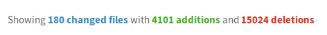

---

# The Reactions

It's magic :(

---

# The Reactions

It's unopinionated :)

---

# The Reactions

It's unopinionated :(

---

# The Reactions

It uses mutable data :)

---

# The Reactions

It uses mutable data :(

---

## Immutable or Mutable _Data_?

---

## Redux or MobX?

---

.background[
    
]

---

# Immutable Data

.lighten.background[
    
]

<ol style="clear:none; position: relative; left: 200px; width:400px;">
<li>State snapshots</li>
<li>Replayable actions</li>
<li>State hydration</li>
<li>Traceability</li>
<li>Time travelling</li>
</ol>

---

# Observable, Mutable Data

.lighten.background[
    
]

<ol style="clear:none; position: relative; left: -140px; width: 800px;">
<li>Complex, coupled domains</li>
<li>Complex calculations</li>
<li>Mimimal boilerplate</li>
<li>Efficient</li>
<li>Unopinionated</li>
<li>Encourages strong typing</li>
</ol>

---

The relevance of each benefit is different in each project.

.appear[
What are the driving principles?
]

---

.appear[
_Redux_<br/>Predictability through transactional state
]

.appear[
<br/>
_MobX_<br/>Simplicity through minimally defined,<br/>automatically derived state
]

---

# The Quest For

A minimally defined, *snapshot-able* *state container* with replayable, KISS *actions* and efficient, *transparent* reactive *derivations*

---

class: fullscreen


---

Demo

---

# Snapshotting Observable Mutable Data

.boring[
```
const states = []
```
]
.appear[
```
autorun(() => {
```
]

```
    snapshot = serialize(state)
    states.push(snapshot)
```

.appear[
```
})
```
]

---

# Snapshot Problems

1. .appear[No standardized serialization .appear[(&ldquo;serializr&rdquo; package helps)]]
2. .appear[Deep serializing state is expensive]
3. .appear[No structural sharing]

---

# Solutions

1. .appear[Trees are easy to serialize]
3. .appear[A snapshot is a derived value]
2. .appear[Rendering a tree with structural sharing? <br/>Solved problem]

---

## MobX computed values

---
```
class Person {
    firstName = "Michel"
    lastName = "Weststrate"

    get fullName() {
        console.log("calculating!")
        return [this.firstName, this.lastName]
    }
}
```

---

```
person.firstName = "John"

console.log(person.fullName)
// calculating!

console.log(person.fullName)
// calculating!
```

<small>_Pull Based: Recompute every time value is needed_</small>

---

```
class Person {
    @observable firstName = "Michel"
    @observable lastName = "Weststrate"

    @computed get fullName() {
        console.log("calculating!")
        return [this.firstName, this.lastName]
    }
}
```
---
```
person.firstName = "John"
// calculating!

console.log(person.fullName)

console.log(person.fullName)
```

<small>_Push Based: Recompute when a source value changes_</small>

---

# Snapshotting Observable Mutable Data

.boring[
```
class Todo {
    @observable id = 0
    @observable text = ""
    @observable completed = false
```
]

.appear[
```
    @computed get json() {
        return {
            id: this.id,
            text: this.text,
            completed: this.completed
        }
    }
```
]

.boring[
```
}
```
]

---

# Snapshotting Observable Mutable Data

.boring[
```
class TodoStore {
    @observable todos = []
```
]

```
    @computed json() {
        return this.todos.map(
            todo => todo.json
        )
    }
```

.boring[
```
}
```
]

---

class: fullscreen stacked

.appear[]
.appear[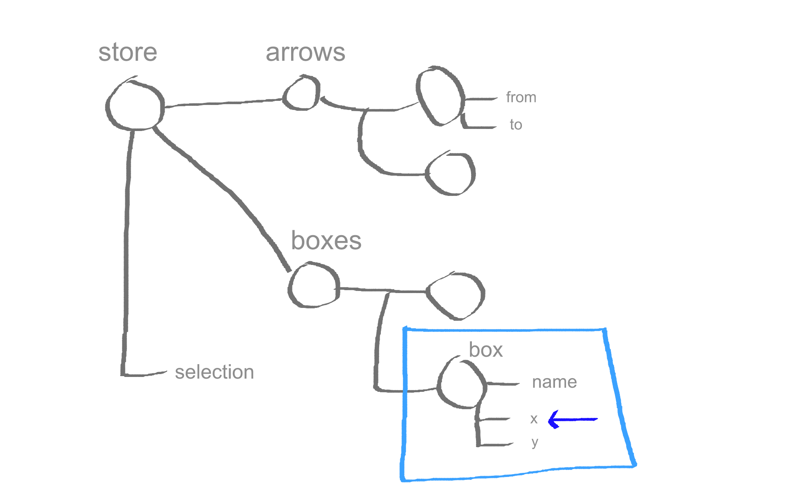]
.appear[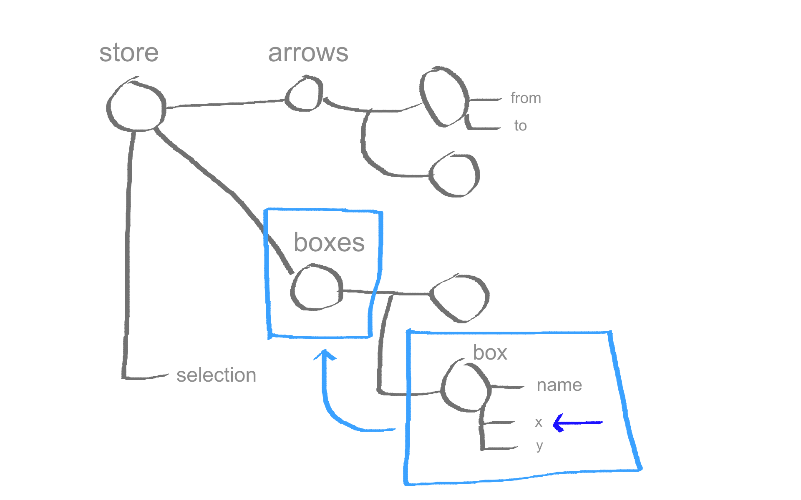]
.appear[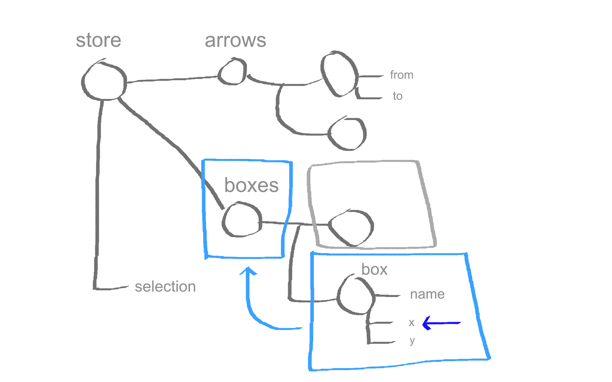]
.appear[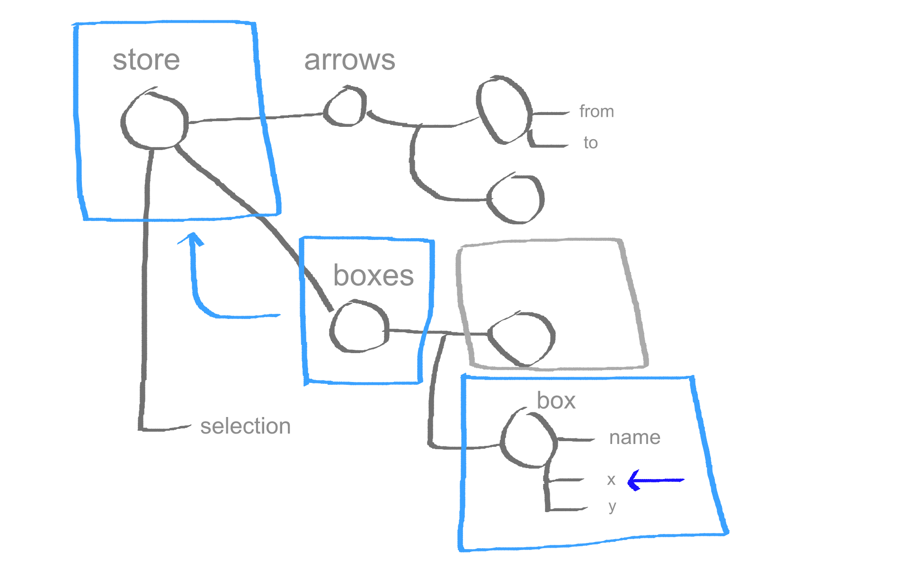]
.appear[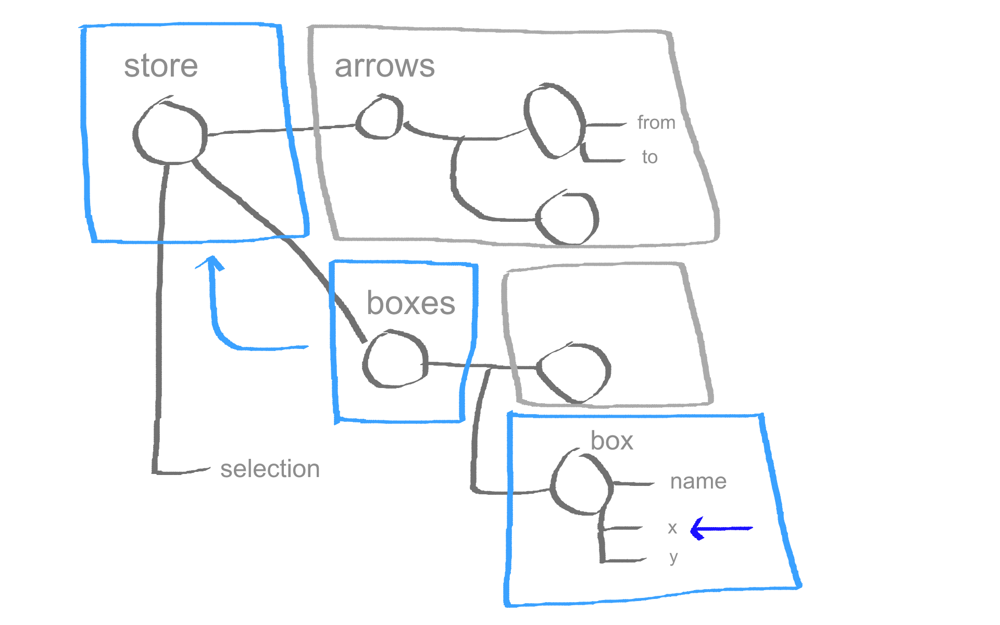]

---

# mobx-state-tree

_opinionated, MobX powered state container_

https://github.com/mobxjs/mobx-state-tree

---

# Core Concepts

.appear[state is a tree of models]

.appear[models are mutable, observable, rich]

.appear[snapshot: immutable representation of the state of a model]

.appear[snapshots & models are interchangeable]

---

class: fullscreen


---

class: fullscreen stacked

.appear[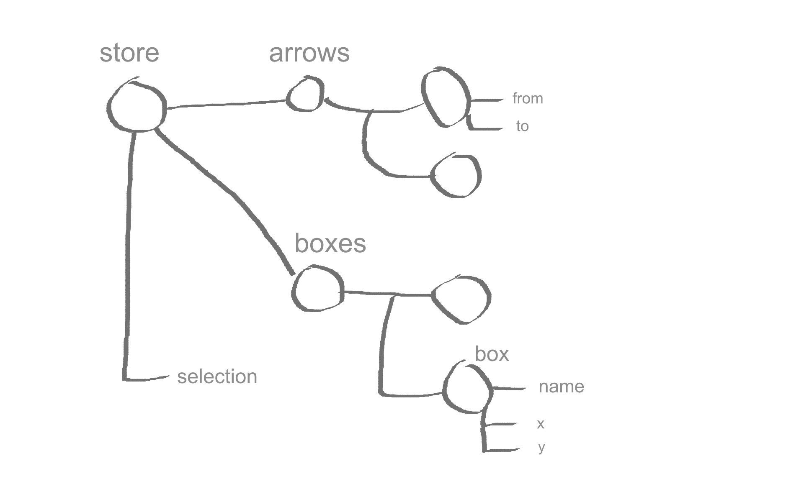]
.appear[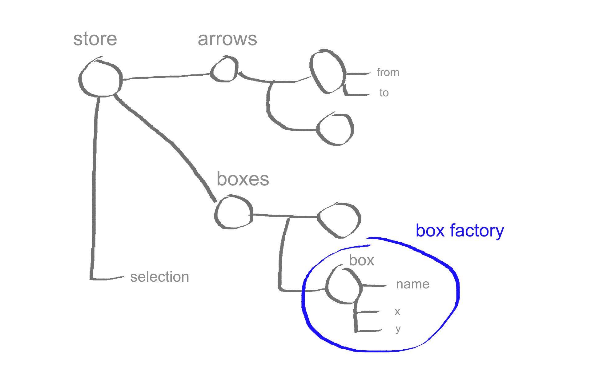]
.appear[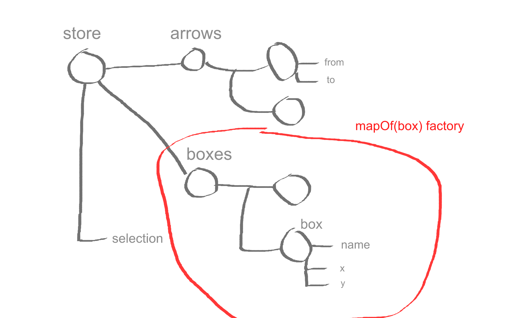]
.appear[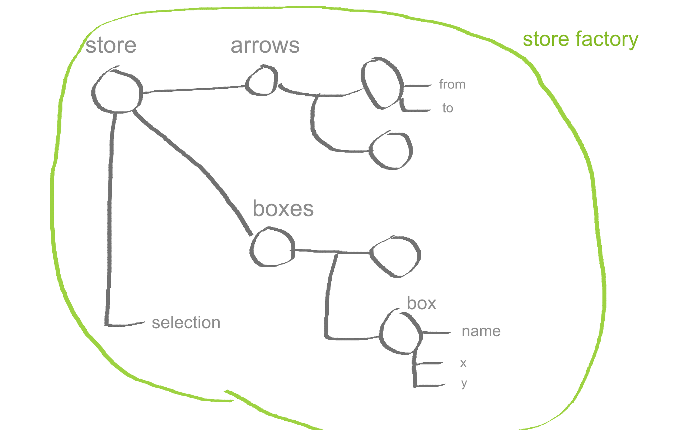]

---

# Factories

.appear[

```
const myModelFactory = createFactory({
    /* exampleModel */

    // properties
    // computed values
    // actions
})
```
]

.appear[
```
// returns fn:
snapshot => observable({...exampleModel, ...snapshot })
```
]

---

# Factories

.boring[
```
import {createFactory} from "mobx-state-tree"
```
]

```javascript
const Box = createFactory({
    name: "A cool box instance",
    x: 0,
    y: 0,

    get width() {
        return this.name.length * 15;
    }
})
```

.appear[
```
const box1 = Box({ name: "Hello, Reactive2016!" })
```
]
---

# Factories

.boring[
```
import {createFactory, mapOf, arrayOf} from "mobx-state-tree"
```
]
```
const Store = createFactory({
    boxes: mapOf(Box),
    arrows: arrayOf(Arrow),
    selection: ""
})
```

---

.lighten.background[
    
]

# Snapshots

Representation of the state of a model<br/> at a particular moment in time

---

# Snapshots

```
    getSnapshot(model): snapshot
```
```
    applySnapshot(model, snapshot)
```
```
    onSnapshot(model, callback)
```
---

# Time Travelling

```
const states = [];
let currentFrame = -1;

onSnapshot(store, snapshot => {
    if (currentFrame === states.length -1) {
        currentFrame++
        states.push(snapshot);
    }
})

function previousState() {
    if (--currentFrame >= 0)
        applySnapshot(store, states[currentFrame])
}
```

---

# Snapshots & Forms

```javascript
const todoEditor({todo}) => (
    <TodoEditForm
        todo={clone(todo)}
        onSubmit={
            (modifiedTodo) => {
                applySnapshot(todo, getSnapshot(modifiedTodo))
            }
        }
    />
)
```
.appear[
```javascript
function clone(model) {
    return getFactory(model)(getSnapshot(model))
}
```
]

---


# Snapshots & Testing

```javascript
const todo = clone(exampleTodo)

todo.markCompleted()

assert.deepEqual(getSnapshot(todo), {
    title: "test", completed: true
})
```

---

# Snapshots & Jest

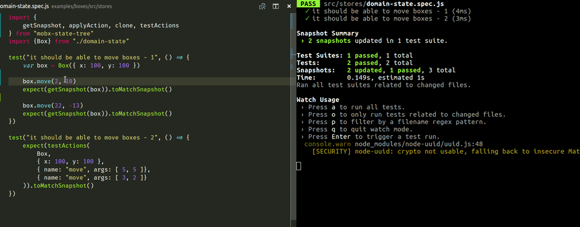

```
expect(getSnapshot(todo)).toMatchSnapshot()
```

---

Demo

---

# Snapshots & Syncing

```
onSnapshot(store, (data) => {
    socketSend(data)
})

onSocketMessage((data) => {
    applySnapshot(store, data)
})
```

---

.lighten.background[
    
]

# Patches

JSON-patch rfc6902

*Changes need to be broadcasted!*

---

# Patches

```
    onPatch(model, calback)
```
```
    applyPatch(model, jsonPatch)
```
---

Demo

---

# Patches & Syncing

```
onPatch(store, (data) => {
    socketSend(data)
})

onSocketMessage((data) => {
    applyPatch(store, data)
})
```
---

# Patches

```javascript
onPatch(store, patch => console.dir(patch))

onPatch(store.box.get("0d42afa6"), patch => console.dir(patch))
```
.appear[
```
store.box.get("0d42afa6").move(5, 0)
```
]
.appear[
```
// output:

{ op: "replace", path: "/boxes/0d42afa6/x", value: 105 }

{ op: "replace", path: "/x", value: 105 }
```
]
---

class: fullscreen stacked

.appear[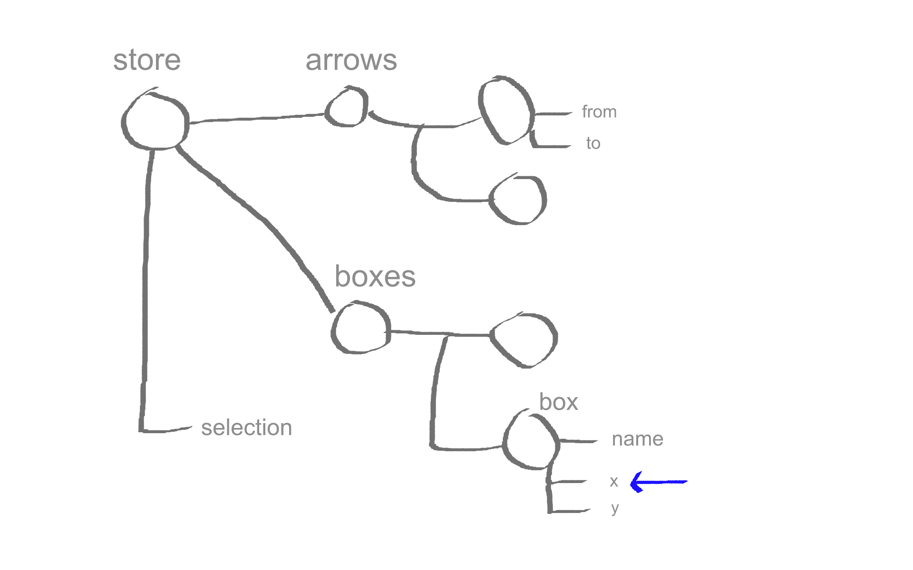]
.appear[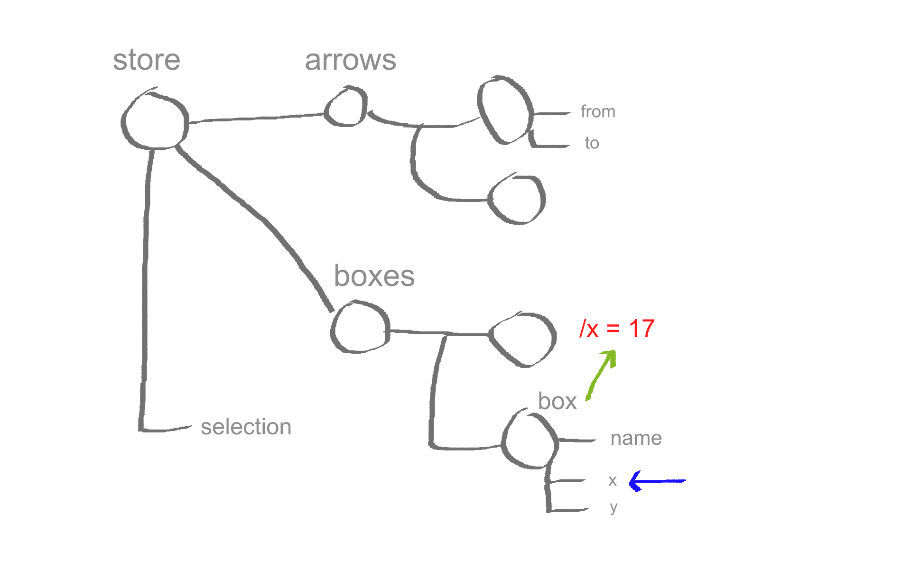]
.appear[]
.appear[]

---

.lighten.background[
    
]

# Actions

*snapshots + replayable actions = transactional state*

---

What if an action description is the effect,

instead of the cause of a function call?

---

# Actions

.boring[
```javascript
const Box = createFactory({
    x: 0,
    y: 0,
```
]

```
    move: action(function(dx, dy) {
        this.x += dx
        this.y += dy
    })
```

.boring[
```
})
```
]
.appear[
```
box1.move(10, 10)
```
]
---

# Actions

```
    onAction(model, callback)
```
```
    applyAction(model, actionCall)
```

---

# Actions & Middleware

```javascript
onAction(store, (action, next) => {
    console.dir(action)
    return next()
})

store.get("ce9131ee").move(23, -8)
```

.appear[
```
// prints:
{
    "name":"move",
    "path":"/boxes/ce9131ee",
    "args":[23,-8]
}
```
]
---

# Actions & Syncing

```
onAction(store, (data, next) => {
    const res = next()
    socketSend(data)
    return res
})

onSocketMessage((data) => {
    applyAction(store, data)
})
```

---
# Actions

* Based on MobX actions
* Unlock part of the state tree for editing
* Emit action events, apply middleware
* Straight forward
* Bound
---

.lighten.background[
    
]

## References

---

# References

```javascript
const myFavoriteBox = store.boxes.get("abc123")

store.selection = myFavoriteBox
```

.appear[
```
//  Throws: element is already part of a state tree
```
]

.appear[
```
store.selection = myFavoriteBox.id
```
]

---

# References

.boring[
```javascript
const Store = createFactory({
    boxes: mapOf(Box),
```
]

```
    selectionId: '',

    get selection() {
        return this.selectionId ? this.boxes.get(this.selectionId) : null
    },
    set selection(value) {
        this.selectionId = value ? value.id : null
    }
```

.boring[
```
})

autorun(() => {
    console.log(store.selection.name)
})

store.selection = myFavoriteBox
```
]
---

# References

```javascript
const Store = createFactory({
    boxes: mapOf(Box),
    selection: referenceTo("/boxes/id")
})
```

.appear[
```javascript
const myFavoriteBox = store.boxes.get("abc123")

store.selection = myFavoriteBox
```
]

---

# mobx-state-tree

A minimally defined,

*snapshot-able*
.appear[]

*state container*
.appear[]

with replayable *actions*
.appear[]

and efficient, *transparent* reactive *derivations*
.appear[]

.appear[_ ..+ patches, middleware, references, dependency injection.._]

---

.background[
    
]

---

Demo

---

redux actions

redux dispatching

redux provider & connect

redux devtools

.appear[

<span style="text-decoration:line-through">redux store</span>

<span style="text-decoration:line-through">redux reducers</span>
]
.appear[

mobx-state-tree factories

mobx-state-tree actions

]
---


.background[
    
]

---

.boring[
```
const initialState = {
    todos: [{
        text: 'learn mobx-state-tree',
        completed: false,
        id: 0
    }]
}
```
]

```
const store = BoxesStore(initialState)
const reduxStore = asReduxStore(store)
connectReduxDevtools(store)
```

.boring[
```
render(
  <Provider store={reduxStore}>
    <App />
  </Provider>,
  document.getElementById('root')
)
```
]

---

```
function asReduxStore(model) {
    return {
        getState : ()       => getSnapshot(model),
        dispatch : action   => {
            applyAction(model, reduxActionToAction(action))
        },
        subscribe: listener => onSnapshot(model, listener),
    }
}

```

---

Demo

---


.lighten.background[
    
]

# mobx-state-tree

Opinionated, transactional, MobX based state container

----

.appear[Try mobx-state-tree]

.appear[.. or just apply the patterns]

.appear[https://egghead.io/courses/mobx-fundamentals]