# The Quest For Immer Mutable State Management

Michel Weststrate - @mweststrate - ReactiveConf 2016

---

Developers are too smart

.appear[(and too expensive)]

.appear[to have them do stupid adminstrative tasks]

.appear[that can be done way better by computers anyway]

---

# The Goal

.appear[
```javascript
const person = {
    name: "michel",
    age: 31
}
```
].appear[
```javascript
const App = ({ person }) => <h1>{ person.name }</h1>
```
].appear[
```javascript
ReactDOM.render(<App person={person} />, document.body)
```
].appear[
```javascript
person.name = "@mweststrate"
```
]

---
class: fullscreen

improve image

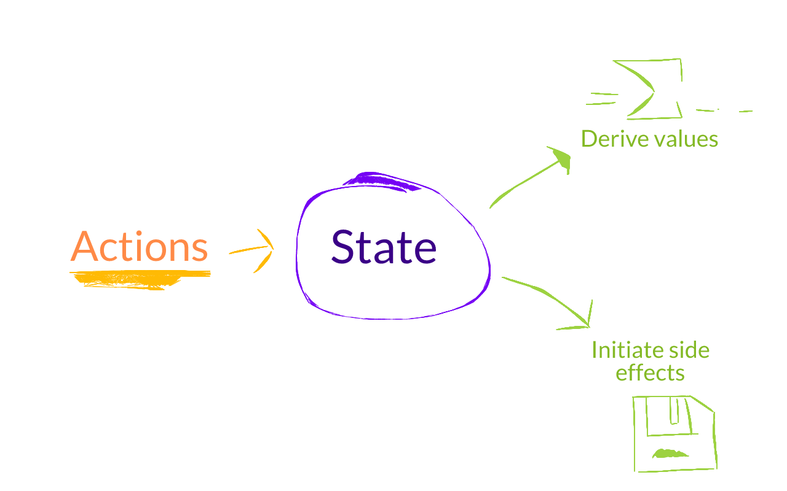

---
# Truly Reactive React

.appear[
```javascript
autorun(() => {
```
]

```javascript
    view = f(state)
```

.appear[
```javascript
})
```
]
---

# The Solution: MobX

.appear[
```javascript
const person = observable({
    name: "michel",
    age: 31
})
```
].appear[
```javascript
const App = observer(({ person }) => <h1>{ person.name }</h1>)
```
].appear[
```javascript
ReactDOM.render(<App person={person} />, document.body)
```

```javascript
person.name = "@mweststrate"
```

http://jsbin.com/wimago/edit?js,output
]

---
class: fullscreen

---

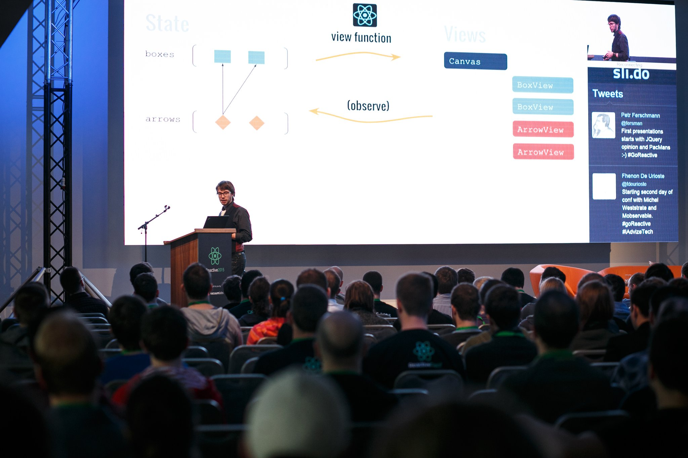

# What happened next

.appear[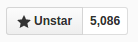]

.appear[
Second most popular state management library.
http://stateofjs.com/2016/statemanagement

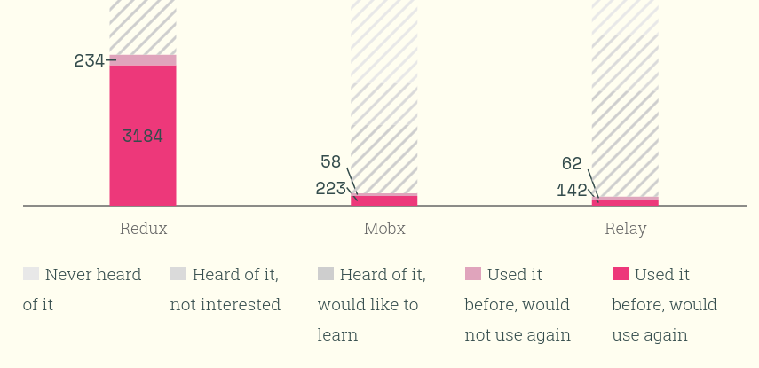

]

---

# The Reactions

It's so simple and fast :)

.appear[
    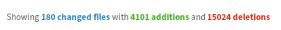
]

---

# The Reactions

It's magic :(

---

# The Reactions

It's unopinionated :)

---

# The Reactions

It's unopinionated :(

---

# The Reactions

It uses mutable data :)

---

# The Reactions

It uses mutable data :(

---

# The benefit of using MobX

1. Dead simple code
5. Mimimal boilerplate, super productive
4. Unopinionated about state structure
5. Efficient
7. Designed for decoupling
6. Encourages strong typing

---

# The benefit of using Redux

1. State snapshots
2. Replayable actions
2. Simple State Hydration
3. Traceability
4. Time travelling

---

# Redux or MobX?

---

class: fullscreen center


---

# Redux or MobX?

.appear[
Redux: Predictability through transactional state.

].appear[
MobX: Simplicity through minimally defined, automatically derivable state.

]

---

# The Quest For

A minimally defined, *snapshot-able* *state container* with replayable *actions* and efficient, *transparent* reactive *derivations*

---

# The Quest For

Excuses to build cool stuffz<br/>
&nbsp;

---

Demo

---

# Snapshotting Observable Mutable Data

.appear[

.boring[
```javascript
import {autorun} from "mobx"
import store from "./store"
```
]

```javascript
const snapshots = []
autorun(() => {
    snapshots.push(store.serializeToJs())
})
```
]

---

# Snapshotting Observable Mutable Data

.appear[
```
autorun(() => {
```
]

```
    snapshot = serialize(state)
```

.appear[
```
})
```
]

---

# Snapshotting Observable Mutable Data

1. .appear[No standardized serialization .appear[(&ldquo;serializr&rdquo; package helps)]]
2. .appear[Deep serializing state is expensive]
3. .appear[No structural sharing]

---

# Snapshotting Observable Mutable Data

1. .appear[Trees are easy to serialize]
3. .appear[A snapshot is a derived value]
2. .appear[Rendering a tree with reuse is a solved problem!]

---

# Snapshotting Observable Mutable Data

.boring[
```
function createTodo(id, text) {
    return observable({
        id,
        text,
        completed: false,
```
]

.appear[
```
        get json() {
            return {
                id: this.id,
                text: this.text,
                completed: this.completed
            }
        }
```
]

.boring[
```
    })
}
```
]

---

# Snapshotting Observable Mutable Data

.boring[
```
function createTodoStore() {
    return observable({
        todos: [],
```
]

```
        get json() {
            return this.todos.map(
                todo => todo.json
            )
        }
```

.boring[
```
    })
}
```
]

---

class: fullscreen stacked

.appear[]
.appear[]
.appear[]
.appear[]
.appear[]
.appear[]

---

# mobx-state-tree

_opinionated, MobX powered state container_

---

# Core concepts

.appear[state is a tree of models]

.appear[models are mutable, observable, rich]

.appear[snapshots are immutable representation of the state]

.appear[snapshots & models are interchangeable]

---

class: fullscreen

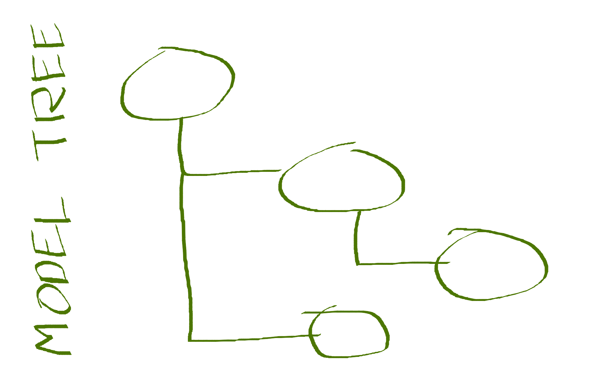

---

class: fullscreen stacked

.appear[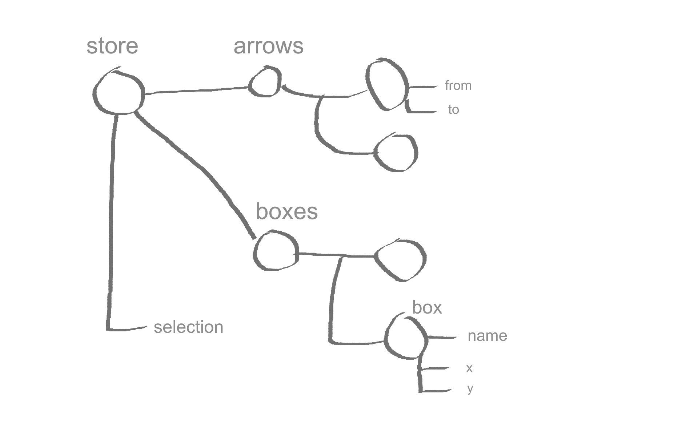]
.appear[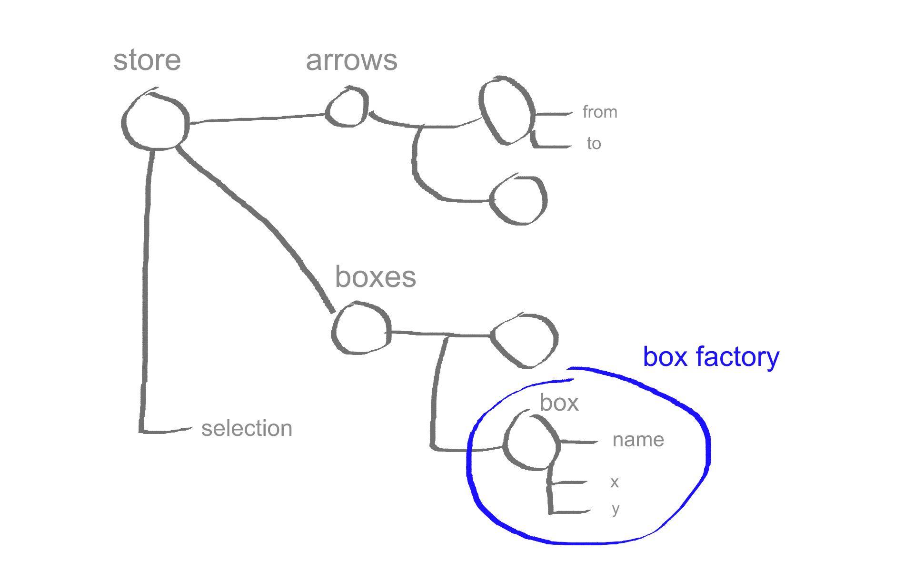]
.appear[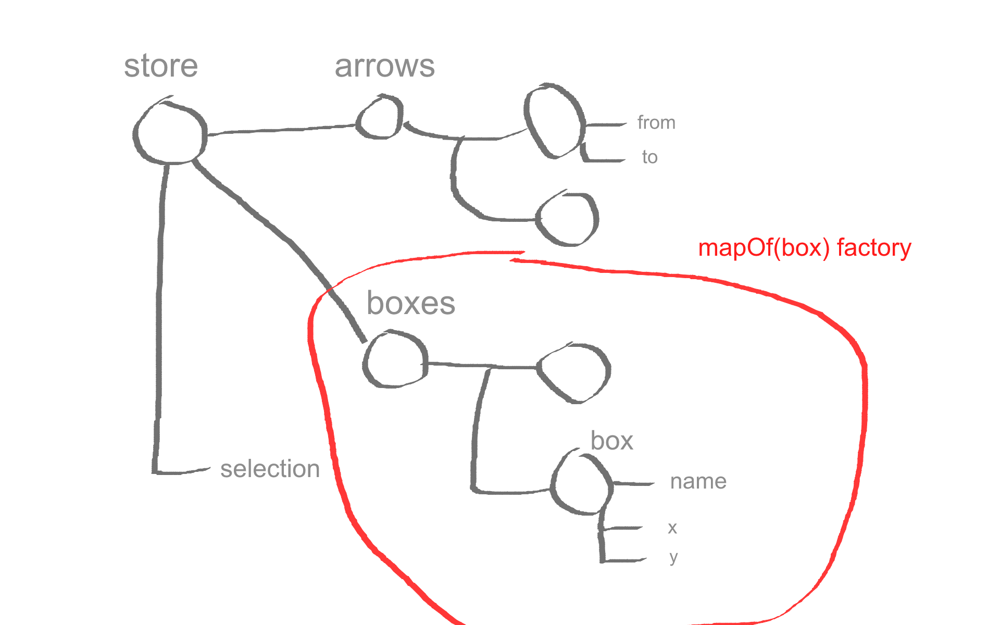]
.appear[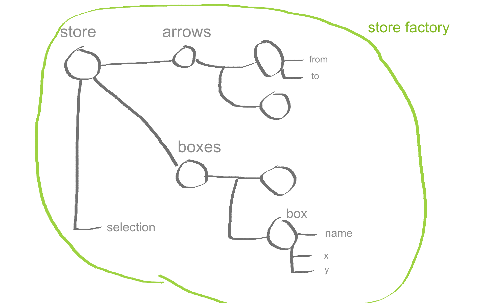]

---

# Data Model

.appear[

```
const myModelFactory = createFactory({
    /* exampleModel */
    // properties
    // computed values
    // actions
    // utilities
})
```
]

.appear[
```
snapshot => observable({...exampleModel, ...snapshot })
```
]

---

# Data model

.boring[
```
import {createFactory} from "mobx-state-tree"
```
]
```
const Box = createFactory({
    id: -1,
    name: "A cool box instance",
    x: 0,
    y: 0,
    get width() {
        return this.name.length * 15;
    }
})

const box1 = Box({ id: 17, name: "Hello, Reactive2016!" })
```
---

# Data model

.boring[
```
import {createFactory, mapOf, arrayOf} from "mobx-state-tree"
```
]
```
const Store = createFactory({
    boxes: mapOf(Box),
    arrows: arrayOf(Arrow),
    selection: ""
})
```

---

class: fullscreen

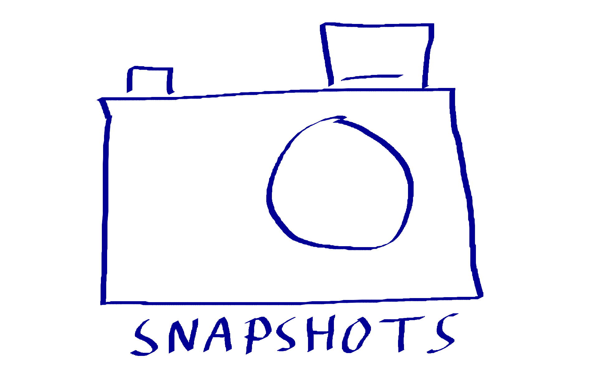

---

# Snapshots

```
    getSnapshot(model): snapshot
```
```
    applySnapshot(model, snapshot)
```
```
    onSnapshot(model, callback)
```
---

# Snapshots & Time Travel

---

.boring[
```
import {getSnapshot, applySnapshot, onSnapshot} from 'mobx-state-tree';
import store from './domain-state';
```
]

```
const states = [];
let currentFrame = -1;

onSnapshot(store, snapshot => {
    if (currentFrame === states.length -1) {
        currentFrame++
        states.push(snapshot);
    }
})

function previousState() {
    if (--currentFrame >= 0)
        applySnapshot(store, states[currentFrame])
}
```

---

# Snapshots & Forms

.boring[

```javascript
import {getFactory, getSnapshot, applySnapshot, clone} from "mobx-state-tree"
```
]

```javascript
const todoEditor({todo}) =>
    <TodoEditForm
        todo={clone(todo)}
        onSubmit={
            modifiedTodo => applySnapshot(todo, getSnapshot(modifiedTodo))
        }
    />
```
.appear.boring[
```javascript
function clone(model) {
    return getFactory(model)(getSnapshot(model))
}
```
]

---

# Snapshots & Testing

```javascript
const todo = clone(exampleTodo)

todo.markCompleted()

assert.deepEqual(getSnapshot(todo), {
    title: "test", complted: true
})
```

---

# Snapshots & Testing


---

# Snapshots & Syncing

Demo

---

# Snapshots & Syncing

.boring[
```javascript
let handlingMessage = false
```
]

```
onSnapshot(store, (data) => {
    if (!handlingMessage)
        socket.send(JSON.stringify(data))
})
```
```
socket.onmessage = (event) => {
    handlingMessage = true
    applySnapshot(store, JSON.parse(event.data))
    handlingMessage = false
}
```

---

class: fullscreen


---

# Patches

JSON-patch rfc6902

*Changes need to be broadcasted!*

---

# Patches

```
    onPatch(model, calback)
```
```
    applyPatch(model, jsonPatch)
```
---

class: fullscreen stacked

.appear[]
.appear[]
.appear[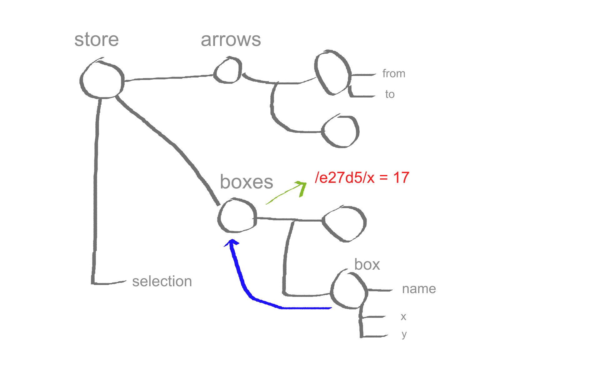]
.appear[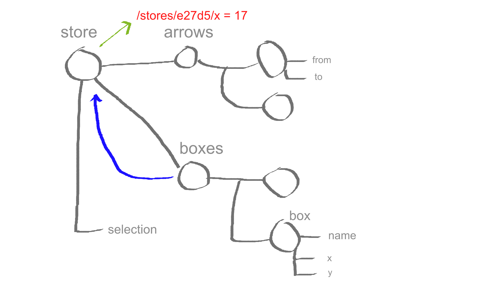]

---

# Patches

```javascript
onPatch(store, patch => console.dir(patch))

onPatch(store.box.get("0d42afa6"), patch => console.dir(patch))
```

```
store.box.get("0d42afa6").move(5, 0)
```

```
// output:

{ op: "replace", path: "/boxes/0d42afa6/x", value: 105 }

{ op: "replace", path: "/x", value: 105 }
```

---

# Patches & Syncing

.boring[
```
let handlingMessage = false
```
]

```javascript
onPatch(store, (data) => {
    if (!handlingMessage)
        socket.send(JSON.stringify(data))
})
```
```
socket.onmessage = (event) => {
    handlingMessage = true
    applyPatch(store, JSON.parse(event.data))
    handlingMessage = false
}
```

---

Demo

---

# Actions

*snapshots + replayable actions = transactional state*

---
# Actions

What if an action description is the effect

instead of the cause of a function call?

---

# Actions

.boring[
```javascript
const Box = createFactory({
    x: 0,
    y: 0,
```
]
```
    move: action(function(dx, dy) {
        this.x += dx
        this.y += dy
    })
```
.boring[
```
})
```
]
```
box1.move(10, 10)
```

---

# Actions

```
    action(fn)
```
```
    onAction(model, callback)
```
```
    applyAction(model, actionCall)
```

---

# Actions & Middleware

```javascript
onAction(store, (action, next) => {
    console.dir(action)
    return next()
})

store.get("ce9131ee").move(23, -8)
```

```
// prints:
{
    "name":"move",
    "path":"/boxes/ce9131ee",
    "args":[23,-8]
}
```

---

# Actions & Syncing

.boring[
```javascript
let handlingMessage = false
```
]

```
onAction(store, (data, next) => {
    next()
    if (!handlingMessage)
        socket.send(JSON.stringify(data))
})
```
```
socket.onmessage = (event) => {
    handlingMessage = true
    applyAction(store, JSON.parse(event.data))
    handlingMessage = false
}
```
---
# Actions

* Based on MobX actions
* Unlock part of the state tree for editing
* Emit action events, apply middleware
* Straight forward
* Bound
---


class: fullscreen

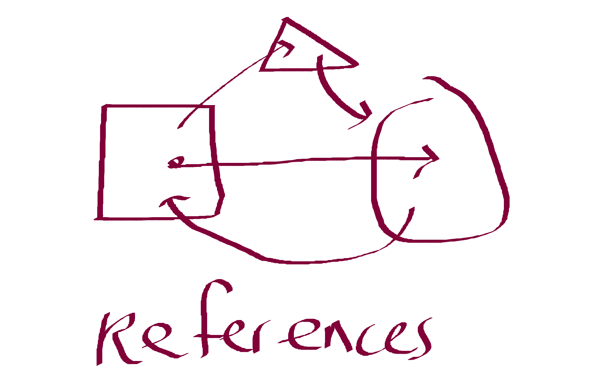

---

# References

*Because my mental picture of the world ain't normalized*

---

# References

```javascript
const myFavoriteBox = store.boxes.get("abc123")

store.selection = myFavoriteBox
```

.appear[
```
//  Throws: element is already part of a state tree
```
]

.appear[
```
store.selection = myFavoriteBox.id
```
]

---

# References

.boring[
```javascript
const Store = createFactory({
    boxes: mapOf(Box),
```
]

```
    selectionId: '',

    get selection() {
        return this.selectionId ? this.boxes.get(this.selectionId) : null
    },
    set selection(value) {
        this.selectionId = value ? value.id : null
    }
```

.boring[
```
})

autorun(() => {
    console.log(store.selection.name)
})

store.selection = myFavoriteBox
```
]
---

# References

```javascript
const Store = createFactory({
    boxes: mapOf(Box),
    selection: referenceTo("/boxes/id")
})
```

---

# mobx-state-tree

A minimally defined,

*snapshot-able*
.appear[]

*state container*
.appear[]

with replayable *actions*
.appear[]

and efficient, *transparent* reactive *derivations*
.appear[]

.appear[_ ..+ patches, middleware, references, dependency injection.._]

---

Demo

---

.boring[
```javascript
import { COMPLETE_ALL } from '../constants/ActionTypes'
import { action } from 'mobx'
import { createFactory, arrayOf } from 'mobx-state-tree'
```
]

```
const todoFactory = createFactory({
    text: '', completed: false, id: 0
})

const storeFactory = createFactory({
  todos: arrayOf(todoFactory),

  [COMPLETE_ALL]: action(function () {
    const areAllMarked = this.todos.every(todo => todo.completed)
    this.todos.forEach(todo => todo.completed = !areAllMarked)
  })
})
```

---

.boring[
```
import { Provider } from 'react-redux'
import todosFactory from './models/todos'
import { asReduxStore, connectReduxDevtools } from 'mobx-state-tree'

const initialState = {
    todos: [{
        text: 'learn mobx-state-tree',
        completed: false,
        id: 0
    }]
}
```
]

```
const store = storeFactory(initialState)
const reduxStore = asReduxStore(store)
connectReduxDevtools(store)
```

.boring[
```
render(
  <Provider store={reduxStore}>
    <App />
  </Provider>,
  document.getElementById('root')
)
```
]

---

.boring[
```javascript
import {onSnapshot, getSnapshot, applyAction} from "mobx-state-tree"
```
]

```
export function asReduxStore(model, ...middlewares) {
    return {
        getState : ()       => getSnapshot(model),
        dispatch : action   => {
            applyAction(model, reduxActionToAction(action))
        },
        subscribe: listener => onSnapshot(model, listener),
    }
}

```

---

# mobx-state-tree

Opinionated, transactional state MobX based state container

----

.appear[Try mobx-state-tree]

.appear[.. or just apply the patterns]

.appear[https://egghead.io/courses/mobx-fundamentals]