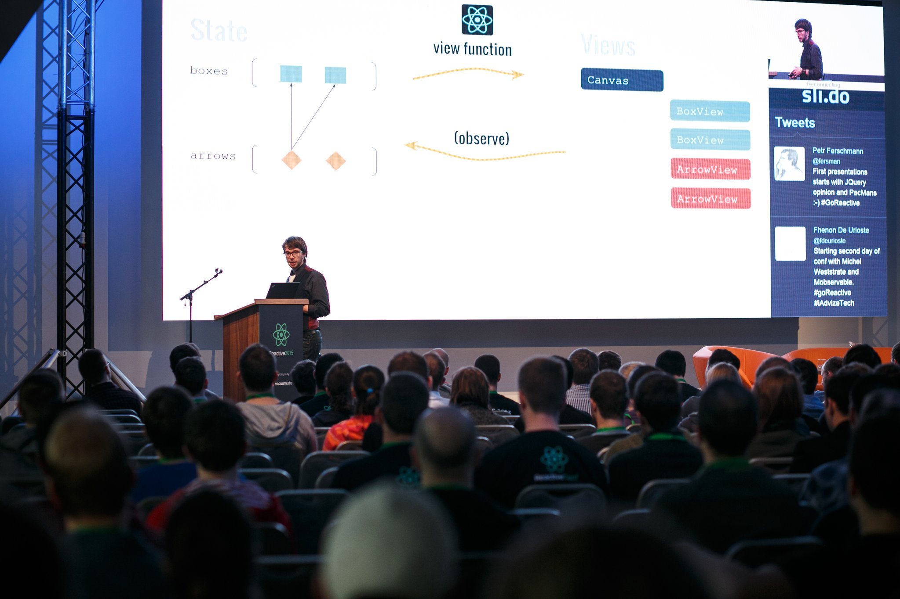
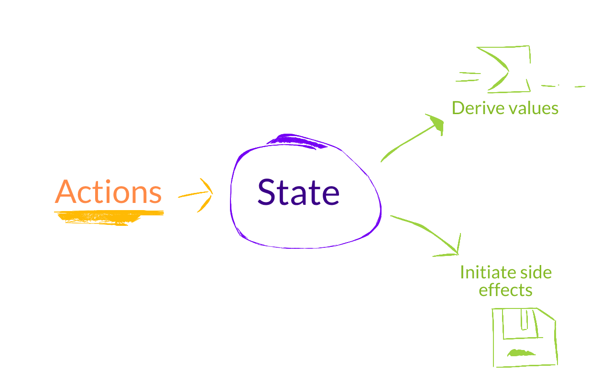
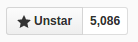
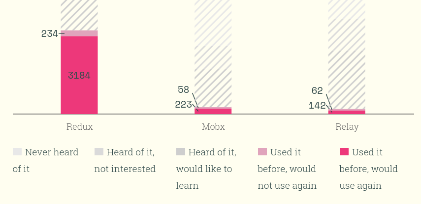

# The Quest For Immer Mutable State Management

Michel Weststrate - @mweststrate - ReactiveConf 2016

---

# One Year Ago

---

class: fullscreen



---

# The Mission

Developers are too smart

.appear[(and too expensive)]

.appear[to have them do stupid adminstrative tasks]

.appear[that can be done way better by computers anyway.]

---

# The Goal

.appear[
```javascript
const person = {
    name: "michel",
    age: 31
}
```
].appear[
```javascript
const App = ({ person }) => <h1>{ person.name }</h1>
```
].appear[
```javascript
ReactDOM.render(<App person={person} />, document.body)
```
].appear[
```javascript
person.name = "@mweststrate"
```
]

---

# The Solution

.appear[Transparent] reactive programming.

.appear[Find the minimal state]

.appear[Express all other things as derivation]

.appear[MobX will take care of running your derivations]

---

class: fullscreen



---

# The Solution

.appear[
```javascript
autorun(() => {
```
]

```javascript
    view = f(data)]
```

.appear[
```javascript
})
```
]

---


# The Solution

.appear[
```javascript
const person = observable({
    name: "michel",
    age: 31
})
```
].appear[
```javascript
const App = observer(({ person }) => <h1>{ person.name }</h1>)
```
].appear[
```javascript
ReactDOM.render(<App person={person} />, document.body)
```

```javascript
person.name = "@mweststrate"
```
]

<!--- http://jsbin.com/wimago/edit?js,output -->

---

# What happened next

.appear[]

.appear[
Second most popular state management library.
http://stateofjs.com/2016/statemanagement



]

---

# The Reactions

It's so simple and fast :)

---

# The Reactions

It's magic :(

---

# The Reactions

It's unopinionated :)

---

# The Reactions

It's unopinionated :(

---

# The Reactions

It uses mutable data :)

---

# The Reactions

It uses mutable data :(

---

# The benefit of using MobX

1. Dead simple code
5. Mimimal boilerplate, super productive
5. Efficient
4. Unopinionated
7. Designed for decoupling
6. Encourages strong typing

---

# The benefit of using Redux

1. State snapshots
2. Replayable actions
2. Simple State Hydration
3. Traceability
4. Time travelling

---

# Redux or MobX?

---

class: fullscreen


---

# Redux or MobX?

.appear[
> Redux: a predictable state container.

]
.appear[
> MobX: Anything that can be derived from the application state, should be derived. Automatically.

]

---

class: fullscreen


---

# Predictability: Transactional State

1. Immutable Snapshots
2. Replayable Actions

---


# Redux or MobX ... or Both?

The Quest For:

A minimally defined, *snapshot-able* *state container* with replayable *actions* and efficient, transparent reactive *derivations*

---

# Ok, it's just an excuse..

Let's build something cool!

---

# Snapshotting Observable Mutable Data

Last year:

.appear[
```javascript
import {autorun} from "mobx"
import store from "./store"

const snapshots = []

autorun(() => {
    snapshots.push(store.serializeToJs())
})

```
]

---

# Mutable Data Problems

1. .appear[No standardized serialization .appear[(`serializr` helps)]]
2. .appear[Deep cloning is expensive]
3. .appear[No structural sharing]

---

class: middle center

# A Snapshot Is Just Another Derivation

---

# A Snapshot Is Just Another Derivation

```javascript
import {observable, computed} from "mobx"

class Box {
    id; // for react
    @observable name = 'Box' + this.id;
    @observable x = 0;
    @observable y = 0;
    @computed get width() {
        return this.name.length * 15;
    }

    @computed get json() {
        return {
            id: this.id
            name: this.name,
            x: this.x,
            y: this.y
        }
    }
}
```
---

# ... With Automatic Structural Sharing!

```javascript
class Store {
    @observable boxes: [],
    @observable arrows: [],
    @observable selection: null

    @computed json() {
        return {
            boxes: this.boxes.map(box => box.json),
            arrows: this.arrows.map(arrow => arrow.json),
            selection: this.selection ? store.selection.id : null
        }
    }
}
```

(Since computed values are cached)

---

Plaatje

---

# mobx-state-tree

Opinionated MobX Powered State Container

* Tree Structure
* Predefined data models
* Built-in snapshotting
* .. And many other things

---

# duality

* Snapshots are immutable and plain structures
* Models are mutable, observable
* Models are rich: computed values, functions

---

# Data Model

*'cause constraints enable generic features*

---

# Data model

*createFactory(exampleModel)*

returns function: `(snapshot) => modelObject`

conceptually: `snapshot => ({...exampleModel, ...snapshot })`

---

# Data model

```javascript
import {createFactory} from "mobx-state-tree"

const Box = createFactory({
    id: '',
    name: '',
    x: 0,
    y: 0,
    // computed value
    get width() {
        return this.name.length * 15;
    }
})

const box1 = Box({ name: "Hello, Reactive2016!" })
```
---

# Data model

```javascript
import {createFactory, mapOf, arrayOf}

const Store = createFactory({
    boxes: mapOf(Box),
    arrows: arrayOf(Arrow),
    selection: ""
})
```

---

# Demo

<!-- Drag Boxes-->

---

# Snapshots

*without them you can't have transactional state*

---

# Snapshots

* *getSnapshot(model): snapshot*

* *applySnapshot(model, snapshot)*

* assigning a *snapshot* to a property of a *model* automatically instantiates a new model: `store.arrows[0] = { id: "20", from: "127", to: "13" }`

---

# Snapshots & Time Travel

```javascript
import store from './domain-state';
import {getSnapshot, applySnapshot, onSnapshot} from 'mobx-state-tree';

var states = [];
var currentFrame = -1;

onSnapshot(store, snapshot => {
    if (currentFrame === states.length -1) {
        currentFrame++
        states.push(snapshot);
    }
})

export function previousState() {
    if (currentFrame === 0)
        return
    currentFrame--;
    applySnapshot(store, states[currentFrame])
}
```

---

# Demo

<!-- time travel -->

---

# Snapshots & Forms

```javascript
function clone(model) {
    return getFactory(model)(getSnapshot(model))
}

const todoEditor({todo}) =>
    <TodoEditForm
        todo={clone(todo)}
        onSubmit={
            modifiedTodo => applySnapshot(todo, getSnapshot(modifiedTodo))
        }
    />
```
---

# Snapshots & Testing

```javascript
const todo = clone(exampleTodo)
todo.markCompleted()
assert.deepEqual(getSnapshot(todo), {
    title: "test", complted: true
})
```

---

Jest

---

# Snapshots & Syncing

```javascript
let handlingMessage = false
onSnapshot(store, data => {
    if (!handlingMessage)
        socket.send(JSON.stringify(data))
})
socket.onmessage = event => {
    handlingMessage = true
    applySnapshot(store, JSON.parse(event.data))
    handlingMessage = false
}
```

---

Demo

---

# References

*Because my mental picture of the world ain't normalized*

---

# References

```javascript
store.selection = store.boxes.get("abc123")
// Throws: already part of a state tree

```

---

# References

```javascript
const Store = createFactory({
    boxes: mapOf(Box),
    arrows: arrayOf(Arrow),
    selectionId: '',
    get selection() {
        return this.selectionId ? this.boxes.get(this.selectionId) : null
    },
    set selection(value) {
        this.selectionId = value ? value.id : null
    },
})

autorun(() => {
    console.log(store.selection.name)
})
```

---

# References

```javascript
const Store = createFactory({
    boxes: mapOf(Box),
    arrows: arrayOf(Arrow),
    selection: referenceTo("/boxes/id"),
})


autorun(() => {
    console.log(store.selection.name)
})
```

---

# Patches

JSON-patch rfc6902

*Changes need to be distributed*

---

# Patches

* observes fine grained changes in data
* *onPatch(model, calback: jsonPatch => void)*
* *applyPatch(model, jsonPatch)*

---

# Patches

```javascript
onPatch(box, patch => console.dir(patch))
onPatch(store, patch => console.dir(patch))

// output of moving a box:
{ op: "replace", path: "/x", value: 105 }

{ op: "replace", path: "/boxes/0d42afa6/x", value: 105 }
```

---

# Patches & Syncing

```javascript
let handlingMessage = false
onPatch(store, data => {
    if (!handlingMessage)
        socket.send(JSON.stringify(data))
})
socket.onmessage = event => {
    handlingMessage = true
    applyPatch(store, JSON.parse(event.data))
    handlingMessage = false
}
```

---

# Demo

---

# Actions

*snapshots + replayable actions = transactional state*

---

# Actions

What if a action call is the effect and not the cause?

---

# Actions

* Based on MobX actions
* Unlock part of the state tree for editing
* Emit action event, applies middleware
* Run's mutation based action
* Bound

---


# Actions

```javascript
const Box = createFactory({
    x: 0,
    y: 0,
    move: action(function(dx, dy) {
        this.x += dx
        this.y += dy
    })
})

box1.move(10, 10)
```

---

# Actions

```javascript
const Store = createFactory({
    arrows: arrayOf(Arrow),
    addArrow: action(function(fromId, toId) {
        this.arrows.push(Arrow({ id: randomUuid(), fromId, toId }))
    }),
})
```

---

# Actions

* *action(fn)* user actions that modify part of the state tree
* *onAction(model, callback: actionCall => void)*
* *applyAction(model, actionCall)*

---

# onAction

```javascript
onAction(store, (action, next) => {
    console.dir(action)
    return next()
})

box.move(23, -8)

// prints:
{
    "name":"move",
    "path":"/boxes/ce9131ee-f528-4952-a012-543780c5e66d",
    "args":[23,-8]
}
```

---

# Actions & Syncing

```javascript
let handlingMessage = false
onAction(store, (data, next) => {
    next()
    if (!handlingMessage)
        socket.send(JSON.stringify(data))
})
socket.onmessage = event => {
    handlingMessage = true
    applyAction(store, JSON.parse(event.data))
    handlingMessage = false
}
```
---

---

# Testing Actions

Jest

# Demo

---

# Integrates with MobX

```javascript
import React, {Component} from 'react';
import {observer} from 'mobx-react';

const ArrowView = ({arrow}) => {
    const {from, to} = arrow
    if (!from || !to) return null
    const [x1, y1, x2, y2] = [
        from.x + from.width / 2,
        // .. more math
    ]
    return <path className="arrow"
        d={`M${x1} ${y1} L${x2} ${y2}`}
    />
}

export default observer(ArrowView)
```

---

# Summarizing mobx-state-tree

Table:

* Observable, mutable tree of models. Actions, computed values, etc.
* Snapshots `getSnapshot`, `onSnapshot` and `applySnapshot`
* Patches `onPatch`, `applyPatch`
* Actions `onAction`, `applyAction`, middleware


---

Demo #1
<!-- todomvc, redux -->

---

# A state tree is a Redux store!

(almost)

```javascript
import { ADD_TODO, DELETE_TODO, EDIT_TODO, COMPLETE_TODO, COMPLETE_ALL, CLEAR_COMPLETED } from '../constants/ActionTypes'
import { action } from 'mobx'
import { createFactory, arrayOf } from 'mobx-state-tree'

export const todoFactory = createFactory({
    text: '', completed: false, id: 0
})

export default createFactory({
  todos: arrayOf(todoFactory),
  [COMPLETE_ALL]: action(function () {
    const areAllMarked = this.todos.every(todo => todo.completed)
    this.todos.forEach(todo => todo.completed = !areAllMarked)
  })
})
```
---

# A state tree is a Redux store!

```javascript
import { Provider } from 'react-redux'
import App from './containers/App'
import todosFactory from './models/todos'
import { asReduxStore } from 'mobx-state-tree'

const initialState = { ... }
const todos = todosFactory(initialState)
const store = asReduxStore(todos)

render(
  <Provider store={store}>
    <App />
  </Provider>,
  document.getElementById('root')
)

```

---

```javascript
import {onSnapshot, getSnapshot, applyAction} from "../index"

export function asReduxStore(model, ...middlewares) {
    return {
        getState : ()       => getSnapshot(model),
        dispatch : action   => {
            applyAction(model, reduxActionToAction(action))
        },
        subscribe: listener => onSnapshot(model, listener),
    }
}

```
---

Demo: todo redux devtools in todomvc

---
* `connectReduxDevtools(model)`
---

Demo time travel in boxes app

---

# Conclusion

Comparisin table

Not covered:
* middleware
* dependency injection

---

# Conclusion

For whom / when

# Conclusion

# Redux or MobX ... or Both?

# mobx-state-tree

A transactional, minimally defined *state container* with replayable *actions* and efficient, transparent reactive *derivations*
.appear[Bonus: JSON patches, references, dependency injection]

.appear[* Learn MobX: https://egghead.io/courses/mobx-fundamentals]
.appear[* Try mobx-state-tree: https://github.com/mweststrate/mobx-state-tree]
.appear[* .. or just apply the patterns]